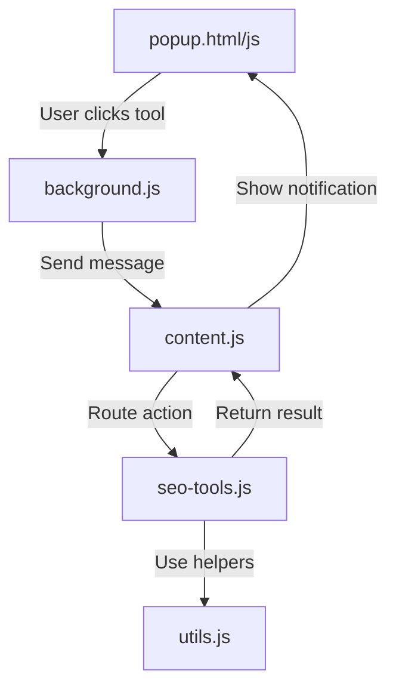

## 📖 Table of Contents

- [✨ Why SEO Tools Pro?](#-why-seo-tools-pro)
- [🚀 Quick Start](#-quick-start)
- [🧰 Feature Showcase](#-feature-showcase)
  - [⭐ Favorites & Context Menu](#-favorites--context-menu)
  - [🤖 AI-Powered Tools](#-ai-powered-tools)
  - [🔍 SEO Analysis](#-seo-analysis)
  - [📧 Email & Outreach](#-email--outreach)
  - [⚡ Advanced Toolkits](#-advanced-toolkits)
- [📁 Installation](#-installation)
- [⌨️ Keyboard Shortcuts](#️-keyboard-shortcuts)
- [🔧 Development](#-development)
- [🐛 Troubleshooting](#-troubleshooting)
- [📞 Support](#-support)

---

## ✨ Why SEO Tools Pro?

Stop jumping between 20 different tabs. **SEO Tools Pro** packs everything you need into one sleek popup.

| Traditional Workflow | With SEO Tools Pro |
|:---|:---|
| Open 10+ websites | Click one button |
| Copy/paste between tabs | Everything in one place |
| Manual data entry | AI-generated suggestions |
| No context awareness | Auto-detects page data |

---

## 🚀 Quick Start

```bash
# 1. Clone or download this repository
git clone https://github.com/yourusername/seo-tools-pro.git

# 2. Open Chrome and navigate to:
chrome://extensions/

# 3. Enable "Developer mode" (top-right toggle)

# 4. Click "Load unpacked" and select the folder

# 5. Pin the extension to your toolbar and you're ready!
```

> ⚡ **Pro tip:** Press `Ctrl+Shift+G` (or `Cmd+Shift+G` on Mac) to open the popup instantly.

---

## 🧰 Feature Showcase

### ⭐ Favorites & Context Menu

> Build your personal command center.

Pin your most-used tools to the **Favs** tab. They'll also appear in your **right-click context menu** for zero-click access.

```
Right-click anywhere → SEO Tools Pro → Your Pinned Tools
```

### 🤖 AI-Powered Tools

> Let AI do the heavy lifting.

| Tool | What It Does |
|:---|:---|
| 🏷️ **AI Meta Generator** | Generates SEO titles & descriptions from page content |
| 📝 **SEO Title Generator** | Creates 10+ optimized title variations |
| 💡 **AI Topic Generator** | Suggests blog topics across multiple categories |
| 🖼️ **AI Alt Text Generator** | Smart alt text suggestions for images |

### 🔍 SEO Analysis

> Everything you need to audit any page.

| Category | Tools |
|:---|:---|
| **On-Page** | Heading Structure, Meta Tags, Keyword Density, SERP Preview |
| **Technical** | Schema Validator, robots.txt, Sitemap, URL Optimizer |
| **Links** | Do-Follow Highlighter, Broken Link Checker (with CSV), Internal/External Analysis |
| **Local SEO** | Multi-City Keyword Finder, Maps Scraper, Citation Finder |
| **Reporting** | SEO Dashboard, Audit Checklist, Export SEO Data |

### 📧 Email & Outreach

> Pre-written templates with dynamic variables.

| Template Type | Examples |
|:---|:---|
| 💰 **Payment** | PayPal Request, GCash Request, Send Invoice |
| 📝 **Article** | Sending Article, Follow-ups (1st, 2nd, Final), Cancellation |
| 🤝 **Outreach** | Guest Post Outreach, Negotiation, Contact Form Filler |

**Variables you can use:**
```
{{yourName}}  {{webmaster}}  {{website}}  {{amount}}  {{articleTitle}}
```

### ⚡ Advanced Toolkits

> Power tools for power users.

| Toolkit | Features |
|:---|:---|
| 🖼️ **Image Toolkit** | Resize, Convert (WebP/PNG/JPEG), Optimize, Free Stock Sources |
| 🔍 **Text Compare** | Similarity %, Reading Time, Keyword Gaps, Readability Scores |
| 📂 **Bulk URL Opener** | Paste a list, open all tabs with progress tracking |
| 📸 **Full Page Capture** | Screenshot entire page (even off-screen content) |
| 📊 **Keyword Rank Tracker** | Find your domain's position in Google (up to 100 results) |
| 🌐 **Deep Domain Extractor** | Scrape up to 50 pages of Google results |

---

## 📁 Installation

### 📋 Required Files

Make sure your folder contains **all 8 files**:

```
seo-tools-pro/
├── 📄 manifest.json      # Extension configuration
├── 📄 background.js      # Service worker
├── 📄 utils.js           # Shared helper functions
├── 📄 seo-tools.js       # Core SEO tool logic
├── 📄 content.js         # Page interaction router
├── 📄 popup.html         # Popup interface
├── 📄 popup.css          # Styling (light/dark mode)
└── 📄 popup.js           # Popup logic & favorites
```

### ✅ Manifest V3 Configuration

Your `manifest.json` **must** include the `content_scripts` section:

```json
{
  "manifest_version": 3,
  "name": "SEO Tools Pro",
  "version": "2.4.0",
  "content_scripts": [
    {
      "matches": ["<all_urls>"],
      "js": ["utils.js", "seo-tools.js", "content.js"],
      "run_at": "document_idle"
    }
  ]
}
```

> ⚠️ **Without this section, tools will not work on web pages!**

### 🔄 After Installation

1. Navigate to any website
2. Click the extension icon or press `Ctrl+Shift+G`
3. Start using any of the **85+ tools**!

---

## ⌨️ Keyboard Shortcuts

| Shortcut | Action |
|:---|:---|
| `Ctrl` + `Shift` + `G` | Open extension popup |
| `/` | Focus search (when popup is open) |
| `Ctrl` + `T` | Open Template Manager |
| `Ctrl` + `S` | Open Settings |
| `Ctrl` + `D` | Toggle Dark Mode |
| `Ctrl` + `F` | Focus Search |
| `Esc` | Clear search |

---

## 🔧 Development

### 🏗️ Architecture



### 🔐 Permissions Explained

| Permission | Why It's Needed |
|:---|:---|
| `activeTab` | Execute tools on the current page |
| `clipboardWrite` | Copy results to clipboard |
| `tabs` | Create new tabs for external tools |
| `storage` | Save your settings and templates |
| `scripting` | Inject scripts dynamically |
| `contextMenus` | Right-click quick access menu |
| `<all_urls>` | Work on any website you visit |

---

## 🐛 Troubleshooting

<details>
<summary><b>🔴 Tools don't work on web pages</b></summary>
<br>
<ol>
  <li>Ensure your <code>manifest.json</code> includes the <code>content_scripts</code> section.</li>
  <li>Go to <code>chrome://extensions/</code> and click the <b>Reload</b> button.</li>
  <li>Refresh the web page and try again.</li>
</ol>
</details>

<details>
<summary><b>🔴 Highlights or modals not appearing</b></summary>
<br>
<ol>
  <li>Open DevTools (F12) and check the Console for errors.</li>
  <li>Make sure all 8 files are in the same folder.</li>
  <li>Try disabling and re-enabling the extension.</li>
</ol>
</details>

<details>
<summary><b>🔴 Google Maps scraper not finding businesses</b></summary>
<br>
<ol>
  <li>Scroll down to load more results first.</li>
  <li>Try <b>Manual Selection Mode</b> instead of auto-extract.</li>
  <li>Click on individual business listings in the sidebar.</li>
</ol>
</details>

<details>
<summary><b>🔴 Bulk URL opener blocked by browser</b></summary>
<br>
<ol>
  <li>Allow popups for the current site.</li>
  <li>Reduce the number of URLs (open in batches of 10-15).</li>
  <li>Use the "Open First 15" option when prompted.</li>
</ol>
</details>

---

## 📊 All 85+ Tools at a Glance

| Category | Count | Examples |
|:---|:---:|:---|
| ⭐ Favorites | ∞ | Your pinned tools |
| 📊 SEO Analysis | 25+ | Heading Structure, Meta Tags, Keyword Density |
| 🔗 Link Tools | 8 | Do-Follow Highlighter, Broken Links, Link Extractor |
| 🤖 AI Tools | 5 | Meta Generator, Title Generator, Alt Text |
| 📍 Local SEO | 4 | Keyword Finder, Maps Scraper, Citation Finder |
| 📧 Email Templates | 14 | Payment, Article, Outreach, Negotiation |
| 🔗 Extractors | 6 | Links, Domains, Emails, Social, Deep Google |
| ⚡ Utilities | 12+ | Bulk URL, Full Page Capture, Text Compare, Image Toolkit |
| 🔗 Apps | 7 | Task Tracker, Profiler, Link Tool, PBN Buster |

---

## 📞 Support

<p align="center">
  <a href="https://searchworks.ph"></a>
  <a href="mailto:jonathn.p.harris@gmail.com"></a>
</p>

<p align="center">
  <strong>Developer:</strong> Jonathan Harris<br>
  <strong>Version:</strong> 2.4.0<br>
  <strong>License:</strong> Personal & Professional Use
</p>

---

<p align="center">
  Made with ❤️ by <a href="https://searchworks.ph">SearchWorks.ph</a>
</p>
