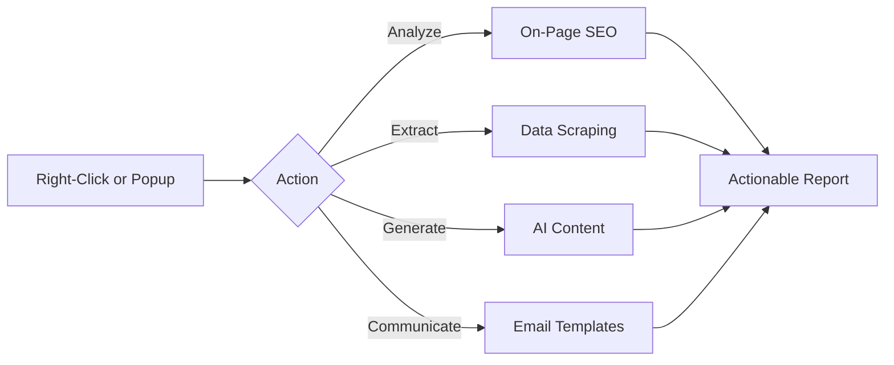
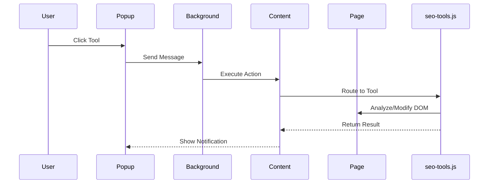

# 🛠️ SEO Tools Pro

<div align="center">


**The Ultimate Chrome Extension for SEO Professionals, Content Marketers, and Link Builders**

[Features](#-features) • [Installation](#-installation) • [Tools Catalog](#-tools-catalog) • [Development](#-development) • [Support](#-support)

</div>

---

## 📑 Table of Contents

- [Why SEO Tools Pro?](#-why-seo-tools-pro)
- [Quick Start](#-quick-start)
- [Architecture Overview](#-architecture-overview)
- [Feature Categories](#-feature-categories)
  - [⭐ Favorites & Context Menu](#-favorites--context-menu)
  - [🤖 AI-Powered Tools](#-ai-powered-tools)
  - [📊 SEO Analysis Suite](#-seo-analysis-suite)
  - [📧 Email & Outreach](#-email--outreach)
  - [🔗 Extractors & Scrapers](#-extractors--scrapers)
  - [⚡ Advanced Toolkits](#-advanced-toolkits)
- [Complete Tools Catalog](#-complete-tools-catalog)
- [Installation Guide](#-installation-guide)
- [Keyboard Shortcuts](#-keyboard-shortcuts)
- [Development & Customization](#-development--customization)
- [Permissions Explained](#-permissions-explained)
- [Troubleshooting](#-troubleshooting)
- [Changelog](#-changelog)
- [Support & Contact](#-support--contact)

---

## ✨ Why SEO Tools Pro?

<div align="center">

| 😫 Traditional Workflow | 🚀 With SEO Tools Pro |
|:---:|:---:|
| Switch between 15+ browser tabs | **Single popup interface** |
| Manual copy/paste between tools | **Auto-detects page data** |
| No contextual awareness | **Right-click context menu** |
| Generic, untargeted tools | **85+ specialized SEO tools** |
| No AI assistance | **AI-powered generators** |

</div>

**SEO Tools Pro** consolidates everything an SEO professional needs into one lightning-fast popup. Whether you're auditing a site, building links, or sending outreach emails—it's all right here.

### Core Philosophy



---

## 🚀 Quick Start

### One-Minute Installation

```bash
# 1. Clone the repository
git clone https://github.com/yourusername/seo-tools-pro.git

# 2. Open Chrome Extensions page
chrome://extensions/

# 3. Enable "Developer mode" (top-right toggle)

# 4. Click "Load unpacked" and select the cloned folder

# 5. Pin the extension for quick access
```

### First Steps After Installation

1. **Pin Your Favorite Tools**: Click the ★ star icon on any tool to add it to your **Favs** tab.
2. **Set Up Your Profile**: Open Settings (⚙️) and add your name, email, and payment defaults.
3. **Try a Quick Tool**: Right-click anywhere → **SEO Tools Pro** → **Copy Current URL**.

---

## 🏗️ Architecture Overview

This extension is built with **Manifest V3** best practices and a modular architecture:

```
seo-tools-pro/
├── 📄 manifest.json          # MV3 Configuration
├── 📄 background.js           # Service Worker (Context Menu, Message Router)
├── 📄 popup.html              # Main UI Structure
├── 📄 popup.css               # Light/Dark Theme (CSS Variables)
├── 📄 popup.js                # UI Logic, Favorites, Search, Settings
├── 📄 content.js              # Content Script Router (Message Listener)
├── 📄 seo-tools.js            # Core Business Logic (85+ tools)
└── 📄 utils.js                # Shared Utilities (Copy, Modal, Notifications)
```

### Data Flow



### Key Technical Highlights

| Feature | Implementation | Benefit |
|:---|:---|:---|
| **Dynamic Injection** | Scripts injected only when needed | Zero performance impact on idle pages |
| **Context Menu Lock** | `isRebuildingMenu` semaphore | Prevents race conditions |
| **CSP-Safe Modals** | Event listeners vs inline `onclick` | Works on strict security pages |
| **Storage Separation** | `sync` for settings, `local` for cache | Efficient data sync across devices |

---

## ⭐ Feature Categories

### ⭐ Favorites & Context Menu

> **Your Personal Command Center**

Pin any tool to your **Favs** tab for instant access. Pinned tools automatically appear in your right-click context menu.

```
Right-click anywhere → SEO Tools Pro → Your Pinned Tools
└── No clicks required to execute!
```

**Pro Tip**: Pin your top 5 most-used tools. They'll be accessible from any page without opening the popup.

---

### 🤖 AI-Powered Tools

> **Let Machine Learning Do the Heavy Lifting**

| Tool | Input | Output | Use Case |
|:---|:---|:---|:---|
| 🏷️ **AI Meta Generator** | Page content | SEO-optimized title & description | On-page optimization |
| 📝 **SEO Title Generator** | H1 + keywords | 10+ title variations | A/B testing titles |
| 💡 **AI Topic Generator** | Niche context | 50+ blog topics across categories | Content planning |
| 🖼️ **AI Alt Text Generator** | Image context | Descriptive alt suggestions | Accessibility & SEO |

**How It Works**: Each AI tool analyzes the current page's content, extracts keywords, and applies SEO best practices to generate human-like suggestions.

---

### 📊 SEO Analysis Suite

> **Comprehensive On-Page & Technical Auditing**

#### On-Page Analysis
| Tool | What It Checks |
|:---|:---|
| **Heading Structure** | H1-H6 hierarchy, skipped levels, duplicates |
| **Meta Tags Analysis** | Title length, description optimization, canonical |
| **Keyword Density** | Top 15 keywords with density percentages |
| **SERP Preview** | Live Google preview of your title/description |
| **Content & Readability** | Flesch score, word count, reading time |

#### Technical SEO
| Tool | What It Checks |
|:---|:---|
| **Structured Data Validator** | JSON-LD schema parsing + Google Rich Results link |
| **Robots.txt Checker** | Fetches and displays robots.txt |
| **Sitemap Finder** | Scans common locations + robots.txt reference |
| **URL Optimizer** | Length, case, stop words, parameter analysis |

#### Link Analysis
| Tool | What It Checks |
|:---|:---|
| **Do-Follow Highlighter** | Green highlights + stats overlay |
| **Broken Link Checker** | Batch HEAD requests + CSV export |
| **Internal vs External** | Link ratio + external domain list |
| **Link Prospect Finder** | Google dork queries for guest post opportunities |

---

### 📧 Email & Outreach

> **Pre-Written Templates with Dynamic Variables**

All templates support these variables:

| Variable | Description | Example |
|:---|:---|:---|
| `{{yourName}}` | Your name (from Settings) | `Jonathan Harris` |
| `{{webmaster}}` | Recipient's name | `John Doe` |
| `{{website}}` | Target website | `example.com` |
| `{{amount}}` | Payment amount | `$50` |
| `{{articleTitle}}` | Article title | `SEO Tips` |
| `{{publishedLink}}` | Live URL | `https://...` |

#### Template Categories

| Category | Templates |
|:---|:---|
| 💰 **Payment** | Advance Payment (PayPal), Payment Request (PayPal/GCash), Send Invoice |
| 📝 **Article** | Sending Article, Quick Article, 1st/2nd/Final Follow-up, Cancellation |
| 🤝 **Outreach** | Guest Post Outreach, Negotiation ($50 offer), Contact Form Auto-Filler |
| 📋 **Response** | Declined Response, Post-Publication Thank You |

**Template Manager Features**:
- ✏️ Create custom templates
- 🔄 Reset to defaults
- 👁️ Live preview with variable substitution
- 📤 Export/Import all templates as JSON

---

### 🔗 Extractors & Scrapers

> **Data Mining Made Simple**

| Extractor | What It Extracts | Output Format |
|:---|:---|:---|
| **Link Extractor** | All links with type (internal/external) and rel (dofollow/nofollow) | CSV, Table |
| **Domain Extractor** | Unique external domains with link frequency count | CSV, List |
| **Email Extractor** | Emails from page text + `mailto:` links | List, Copy All |
| **Social Links** | Facebook, Twitter, LinkedIn, Instagram, YouTube, TikTok, etc. | List, Copy URLs |
| **Google Maps Scraper** | Business name, rating, reviews, address, phone | CSV, Copy All |
| **Deep Google Domain Extractor** | Scrapes up to 50 pages of Google results for unique domains | List, Copy All |

**Google Maps Scraper Modes**:
1. **Extract All Visible**: Grabs all currently loaded results
2. **Manual Selection Mode**: Click individual listings to add
3. **Extract from Sidebar**: Targets the left sidebar feed

---

### ⚡ Advanced Toolkits

> **Power Tools for Power Users**

#### 🖼️ Image Toolkit
| Feature | Capabilities |
|:---|:---|
| **Resizer** | Presets (Thumbnail, Social, OG), custom dimensions, maintain aspect ratio |
| **Converter** | JPEG, PNG, WebP, GIF, BMP, TIFF with quality control |
| **Optimizer** | Compression with savings percentage, WebP conversion option |
| **SEO Analyzer** | Alt text audit, lazy loading check, dimension validation |
| **Free Sources** | 12+ curated free stock photo sites (Unsplash, Pexels, Pixabay, etc.) |

#### 🔍 Advanced Text Compare
| Metric | Description |
|:---|:---|
| **Similarity %** | Jaccard index of unique words |
| **Readability** | Flesch Reading Ease score with grade level |
| **Keyword Gaps** | Words present in one text but missing in the other |
| **SEO Recommendations** | Actionable tips based on comparison results |

#### 📂 Bulk URL Opener
- Paste list of URLs (one per line)
- Smart validation and deduplication
- Batch processing with progress bar
- "Save Session" option for large lists
- Warning for >15 tabs to prevent browser freeze

#### 📸 Full Page Capture
- Scrolls and stitches multiple screenshots
- Handles sticky headers and lazy-loaded images
- Downloads as high-resolution PNG

---

## 📋 Complete Tools Catalog

### SEO Tools (35+)

| Category | Tools |
|:---|:---|
| **Website Analysis** | Wayback Machine, WHOIS, Pingdom, PageSpeed Insights, Schema Validator, Rich Results, AMP Test, Mobile-Friendly |
| **On-Page SEO** | Heading Structure (H1-H6), Meta Tags Analysis, Images Alt Text, Word Count & Readability, Keyword Density, SERP Preview |
| **Link Analysis** | Highlight Do-Follow, Remove Highlights, Internal vs External, Broken Link Checker, Link Prospect Finder, Resource Page Finder |
| **Technical SEO** | Structured Data Check, robots.txt, Sitemap Finder, URL Optimizer, Export SEO Data |
| **Authority & Metrics** | Authority Score (AS), Spam Score (SS), Domain Rating (DR), Organic Traffic (OT), All Metrics |
| **Local SEO** | Multi-City Local Keyword Finder, Maps Scraper, Citation Finder |
| **Reporting** | SEO Dashboard, SEO Audit Checklist, Publication Date Checker |

### AI Tools (5)

- 🏷️ AI Meta Generator
- 📝 SEO Title Generator
- 💡 AI Topic Generator
- 🖼️ AI Alt Text Generator
- 📱 Mobile Usability Test (with scoring)

### Email Templates (14)

- 💵 Advance Payment (PayPal)
- 📬 Payment Request (PayPal)
- 📱 Payment Request (GCash)
- 📄 Send Invoice
- 📤 Sending Article
- ⚡ Quick Article
- 📞 Article Follow-up
- 📞 2nd Follow-up
- ⚠️ Final Notice
- ❌ Cancellation
- 🙏 Declined Response
- 📧 Email Outreach
- 💬 Negotiation ($50)
- 📝 Contact Form Filler

### Extractors (6)

- 🔗 Link Extractor
- 🌐 Domain Extractor
- 🔍 Google Domain Search
- 📧 Email Extractor
- 📱 Social Media Links
- 🌐 Deep Google Domain Extractor (50 pages)

### Utilities (12+)

- 🔗 URL Slug Generator
- 💬 WhatsApp Link Generator
- 📋 Copy Current URL
- 🌐 Copy Domain
- ⬇️ Scroll to Bottom
- ➡️ Next Page
- 📂 Bulk URL Opener
- 📸 Full Page Capture
- 💰 Currency Symbol Copier
- 🔍 Advanced Text Compare
- 🖼️ Image Toolkit
- 🌙 Dark Mode Toggle

### External Apps (7)

- 📋 Task Tracker (searchworks.ph)
- 📊 GDI Profiler
- 🔗 Link Tool
- 🛡️ PBN Buster
- 📖 SearchWorks Blog
- 🎥 YouTube Channel
- 📰 Search Engine Roundtable

---

## 📁 Installation Guide

### Prerequisites
- Google Chrome (v88+ recommended)
- Developer mode enabled in `chrome://extensions/`

### Required Files Checklist

| File | Purpose | Required |
|:---|:---|:---:|
| `manifest.json` | Extension configuration | ✅ |
| `background.js` | Service worker | ✅ |
| `utils.js` | Shared utilities | ✅ |
| `seo-tools.js` | Core tool logic | ✅ |
| `content.js` | Page interaction router | ✅ |
| `popup.html` | Popup interface | ✅ |
| `popup.css` | Styling | ✅ |
| `popup.js` | Popup logic | ✅ |

### Step-by-Step Installation

<details>
<summary><b>📥 Click to expand installation steps</b></summary>

1. **Download or Clone**
   ```bash
   git clone https://github.com/yourusername/seo-tools-pro.git
   ```
   Or download the ZIP and extract.

2. **Open Chrome Extensions**
   - Navigate to `chrome://extensions/`
   - Or: Menu → More Tools → Extensions

3. **Enable Developer Mode**
   - Toggle the switch in the top-right corner

4. **Load the Extension**
   - Click **Load unpacked**
   - Select the folder containing all 8 files

5. **Pin for Quick Access**
   - Click the puzzle icon 🧩 in the toolbar
   - Find "SEO Tools Pro" and click the pin 📌 icon

6. **Verify Installation**
   - You should see the 🛠️ icon in your toolbar
   - Right-click anywhere → "SEO Tools Pro" should appear

</details>

### Post-Installation Setup

1. **Configure Your Profile**
   - Click the extension icon
   - Click ⚙️ Settings
   - Enter your name, email, and payment defaults

2. **Pin Your First Tool**
   - Browse to the **SEO** or **Email** tab
   - Click the ★ star on a tool you use often
   - It appears in your **Favs** tab

3. **Test a Tool**
   - Navigate to any website
   - Click **📋 Copy Domain** in the **Utils** tab
   - A success notification should appear

---

## ⌨️ Keyboard Shortcuts

### Global Shortcuts

| Shortcut | Action |
|:---|:---|
| `Ctrl` + `Shift` + `G` (Mac: `⌘` + `Shift` + `G`) | Open extension popup |
| Right-click → SEO Tools Pro → *Tool* | Execute any pinned tool |

### Popup Shortcuts (When Popup is Open)

| Shortcut | Action |
|:---|:---|
| `/` | Focus search bar |
| `Esc` | Clear search / Close modal |
| `Enter` | Execute first visible tool (after search) |
| `Ctrl` + `T` | Open Template Manager |
| `Ctrl` + `S` | Open Settings |
| `Ctrl` + `D` | Toggle Dark Mode |
| `Ctrl` + `F` | Focus Search |

---

## 🔧 Development & Customization

### Adding a New Tool

<details>
<summary><b>📝 Step-by-step guide to add a custom tool</b></summary>

1. **Add UI Button** (in `popup.html`)
   ```html
   <button class="tool-btn" data-action="my-new-tool">🆕 My New Tool</button>
   ```

2. **Add Tool Logic** (in `seo-tools.js`)
   ```javascript
   function myNewTool() {
     // Your tool logic here
     const pageData = document.body.innerText;
     
     // Show results in modal
     const content = document.createElement('div');
     content.innerHTML = `<p>Results: ${pageData.length} characters</p>`;
     createModal('My New Tool', content);
   }
   ```

3. **Add to Router** (in `content.js`)
   ```javascript
   case 'my-new-tool':
     myNewTool();
     sendResponse({ success: true, message: 'Tool executed!' });
     break;
   ```

4. **Add to Context Menu** (in `background.js`)
   ```javascript
   // In getToolInfo()
   'my-new-tool': { name: '🆕 My New Tool' }
   
   // In rebuildContextMenu() - optional for right-click
   chrome.contextMenus.create({ 
     id: 'my-new-tool', 
     parentId: 'seoToolsPro', 
     title: '🆕 My New Tool', 
     contexts: ['page'] 
   });
   ```

5. **Reload Extension**
   - Go to `chrome://extensions/`
   - Click the refresh icon 🔄 on SEO Tools Pro

</details>

### Modifying Email Templates

Templates are stored in `popup.js` in the `DEFAULT_TEMPLATES` object. You can:

1. Edit the default templates directly
2. Use the **Template Manager** UI to create custom templates (persisted to storage)
3. Import/Export templates as JSON

### Theming

CSS variables in `popup.css` control all colors:

```css
:root {
  --primary-color: #1A56A6;
  --accent-color: #F58220;
  --success-color: #10B981;
  /* ... etc ... */
}

body.dark-mode {
  --primary-color: #60A5FA;
  /* ... dark theme overrides ... */
}
```

---

## 🔐 Permissions Explained

| Permission | Why It's Needed |
|:---|:---|
| `activeTab` | Execute tools only on the current tab (not all tabs) |
| `clipboardWrite` | Copy extracted data, URLs, and generated content |
| `tabs` | Create new tabs for external tools (e.g., PageSpeed Insights) |
| `storage` | Save your settings, favorites, and custom templates |
| `scripting` | Dynamically inject content scripts (only when needed) |
| `contextMenus` | Right-click quick access menu |
| `alarms` | Keep service worker alive (MV3 requirement) |
| `<all_urls>` | Work on any website you visit |

**Privacy Note**: No data is sent to external servers. All processing happens locally in your browser.

---

## 🐛 Troubleshooting

<details>
<summary><b>🔴 Tools don't work on web pages</b></summary>

**Symptoms**: Clicking a tool does nothing or shows "Could not establish connection"

**Solutions**:
1. Ensure `manifest.json` includes the `content_scripts` section
2. Go to `chrome://extensions/` and click **Reload** 🔄
3. Refresh the web page and try again
4. Check DevTools Console (F12) for errors

</details>

<details>
<summary><b>🔴 Context menu not showing favorites</b></summary>

**Solutions**:
1. Open the popup and pin at least one tool (click the ★ star)
2. Go to Settings and verify `favorites` is populated
3. Restart Chrome (service worker may have suspended)

</details>

<details>
<summary><b>🔴 Google Maps scraper not finding businesses</b></summary>

**Solutions**:
1. Scroll down to load more results first
2. Try **Manual Selection Mode** (click individual listings)
3. Ensure you're on `google.com/maps` (not maps.google.com redirect)

</details>

<details>
<summary><b>🔴 Bulk URL opener blocked</b></summary>

**Solutions**:
1. Allow popups for the current site (click the blocked popup icon in address bar)
2. Reduce the number of URLs (use the "Open First 15" option)
3. Try opening in batches of 10-15

</details>

<details>
<summary><b>🔴 Highlights or modals not appearing</b></summary>

**Solutions**:
1. Open DevTools (F12) → Console tab → Check for red errors
2. Verify all 8 files are present in the extension folder
3. Disable and re-enable the extension

</details>

---

## 📝 Changelog

### Version 2.4.0 (Current)
- ✨ Added **SEO Dashboard** with scoring (A+ to F)
- ✨ Added **Publication Date Checker** for content freshness analysis
- ✨ Added **Mobile Usability Test** with tap target validation
- ✨ Added **Duplicate Content Analyzer** with fingerprinting
- ✨ Added **Site Structure Visualizer** with hierarchy analysis
- 🔧 Fixed CSP issues in Google Domain Extractor
- 🔧 Improved modal responsiveness
- 📚 Updated documentation

### Version 2.3.0
- ✨ Added **Advanced Text Compare** tool
- ✨ Added **Image Toolkit** (Resize, Convert, Optimize)
- ✨ Added **Full Page Capture** with stitching
- ✨ Added **Currency Symbol Copier**
- 🔧 Enhanced Broken Link Checker with CSV export

### Version 2.2.0
- ✨ Added **AI Topic Generator**
- ✨ Added **Multi-City Local Keyword Finder**
- ✨ Added **Hreflang Generator**
- ✨ Added **Link Prospect Finder**
- ✨ Added **Resource Page Finder**

### Version 2.1.0
- ✨ Added **AI Meta Generator**
- ✨ Added **SEO Title Generator**
- ✨ Added **AI Alt Text Generator**
- ✨ Added **URL Optimizer**
- ✨ Added **SEO Audit Checklist** with persistence

### Version 2.0.0
- 🎉 Initial public release
- 60+ tools across 6 categories
- Favorites system with context menu integration
- Template manager with custom templates
- Dark mode support

---

## 📞 Support & Contact

<div align="center">

| Contact Method | Details |
|:---|:---|
| 🌐 **Website** | [searchworks.ph](https://searchworks.ph) |
| 📧 **Email** | [jerzycinense1@gmail.com](mailto:jerzycinense1@gmail.com) |
| 📱 **Phone** | +*** |
| 💼 **LinkedIn** | [Jerzy Cinense](https://www.linkedin.com/in/j-b-c/) |

</div>

### Report a Bug

Found an issue? Please include:
1. Chrome version
2. Steps to reproduce
3. Console errors (F12 → Console tab)
4. Screenshot (if applicable)

### Feature Request

Have an idea for a new tool? Let me know! I'm always looking to add genuinely useful SEO tools to the suite.

---

<div align="center">

**Made by [SearchWorks.ph](https://searchworks.ph)**

*"Empowering SEO professionals with the right tools, right in their browser."*

---

⭐ **If you find this extension useful, please share it with your network!** ⭐

</div>
