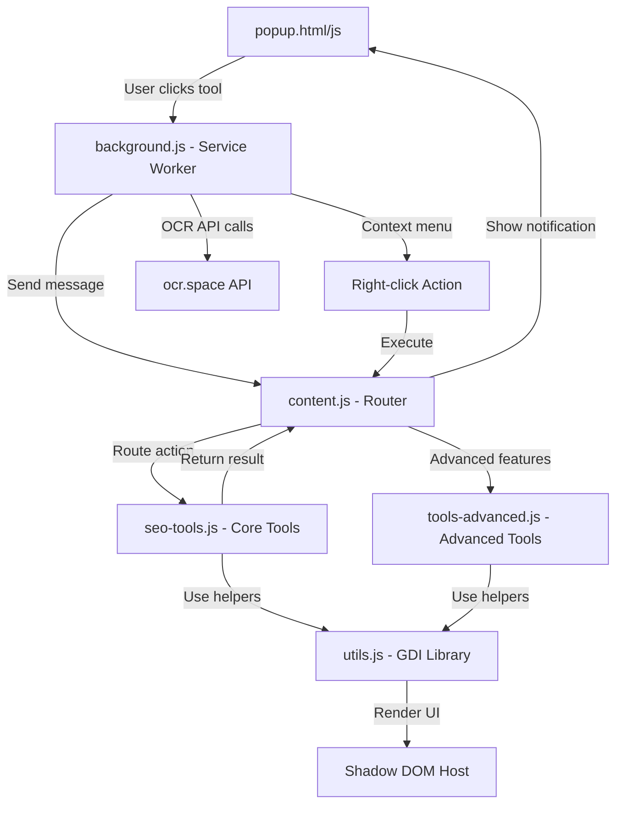

## 📖 Table of Contents

- [✨ Why SEO Tools Pro?](#-why-seo-tools-pro)
- [🚀 Quick Start](#-quick-start)
- [🧰 Feature Showcase](#-feature-showcase)
  - [⭐ Favorites & Context Menu](#-favorites--context-menu)
  - [🤖 AI-Powered Tools](#-ai-powered-tools)
  - [🔍 SEO Analysis](#-seo-analysis)
  - [📧 Email & Outreach](#-email--outreach)
  - [⚡ Advanced Toolkits](#-advanced-toolkits)
- [📁 Installation](#-installation)
- [⌨️ Keyboard Shortcuts](#️-keyboard-shortcuts)
- [✈️ Usage Guide](#️-usage-guide)
  - [Basic Workflow](#basic-workflow)
  - [Right-Click Context Menu](#right-click-context-menu)
  - [Pinning Favorites](#pinning-favorites)
  - [Bulk Operations](#bulk-operations)
  - [Widget Integration](#widget-integration)
- [🔧 Development & Architecture](#-development--architecture)
  - [System Architecture](#system-architecture)
  - [Design System](#design-system)
  - [Security Model](#security-model)
  - [Adding New Tools](#adding-new-tools)
- [🔐 Permissions Explained](#-permissions-explained)
- [🐛 Troubleshooting](#-troubleshooting)
- [📊 All 85+ Tools at a Glance](#-all-85-tools-at-a-glance)
- [🎯 Performance & Best Practices](#-performance--best-practices)
- [📝 Changelog](#-changelog)
- [📞 Support](#-support)

---

## ✨ Why SEO Tools Pro?

Stop jumping between 20 different tabs. **SEO Tools Pro** packs everything you need into one sleek, cohesive popup.

| Traditional Workflow | With SEO Tools Pro |
|:---|:---|
| Open 10+ websites | Click one button |
| Copy/paste between tabs | Everything in one place |
| Manual data entry | AI-generated suggestions |
| No context awareness | Auto-detects page data |

---

## 🚀 Quick Start

```bash
# 1. Clone or download this repository
git clone https://github.com/yourusername/seo-tools-pro.git

# 2. Open Chrome and navigate to:
chrome://extensions/

# 3. Enable "Developer mode" (top-right toggle)

# 4. Click "Load unpacked" and select the folder

# 5. Pin the extension to your toolbar and you're ready!
```

> ⚡ **Pro tip:** Press `Ctrl+Shift+G` (or `Cmd+Shift+G` on Mac) to open the popup instantly.

---

## 🧰 Feature Showcase

### ⭐ Favorites & Context Menu

> Build your personal command center.

Pin your most-used tools to the **Favs** tab. They'll also appear in your **right-click context menu** for zero-click access.

```
Right-click anywhere → SEO Tools Pro → Your Pinned Tools
```

### 🤖 AI-Powered Tools

> Let AI do the heavy lifting.

| Tool | What It Does |
|:---|:---|
| 🏷️ **AI Meta Generator** | Generates SEO titles & descriptions from page content using TF-IDF keyword analysis |
| 📝 **SEO Title Generator** | Creates 10+ optimized title variations with quality scoring |
| 💡 **AI Topic Generator** | Suggests blog topics across 6 categories based on contextual analysis |
| 🖼️ **AI Alt Text Generator** | Smart alt text suggestions with editable previews and confidence scoring |

### 🔍 SEO Analysis

> Everything you need to audit any page.

| Category | Tools |
|:---|:---|
| **On-Page** | Heading Structure, Meta Tags, Keyword Density, SERP Preview, Content Readability, URL Optimizer, Publication Date Checker |
| **Technical** | Schema Validator, robots.txt, Sitemap, Duplicate Content, Hreflang Generator, Mobile Usability Test |
| **Links** | Do-Follow Highlighter, Broken Link Checker (with CSV export), Internal/External Analysis, Link Prospect Finder, Resource Page Finder |
| **Local SEO** | Multi-City Keyword Finder, Maps Scraper, Citation Finder |
| **Reporting** | SEO Dashboard, Automated SEO Audit, Interactive Audit Checklist, Site Structure Visualizer |
| **Design** | Color Theme Extractor, Typography Inspector |

### 📧 Email & Outreach

> Pre-written templates with dynamic variables.

| Template Type | Examples |
|:---|:---|
| 💰 **Payment** | PayPal Request, GCash Request, Send Invoice, Advance Payment |
| 📝 **Article** | Sending Article, Follow-ups (1st, 2nd, Final), Cancellation |
| 🤝 **Outreach** | Guest Post Outreach, Negotiation, Contact Form Auto-Filler, Declined Response |

**Variables you can use:**
```
{{yourName}}  {{webmaster}}  {{website}}  {{amount}}  {{currency}}  {{articleTitle}}  {{publishedLink}}  {{clientAccount}}
```

### ⚡ Advanced Toolkits

> Power tools for power users.

| Toolkit | Features |
|:---|:---|
| 🖼️ **Image Toolkit** | Resize, Convert (WebP/PNG/JPEG), Optimize, Free Stock Sources, SEO Analyzer |
| 🔍 **Text Compare** | Similarity %, Reading Time, Keyword Gaps, Readability Scores, Recommendations, LCS Diff View |
| 📂 **Bulk URL Opener** | Paste a list, open all tabs with progress tracking and pause/resume control |
| 📸 **Full Page Capture** | Screenshot entire page with intelligent stitching (handles fixed/sticky elements) |
| 📊 **Keyword Rank Tracker** | Find your domain's position in Google (up to 100 results across 10 pages) |
| 🌐 **Deep Google Domain Extractor** | Scrape up to 50 pages of Google results with filtering and export |
| 🗺️ **Google Maps Scraper** | Auto-scroll extraction with manual mode, real-time stats, CSV/JSON/Markdown export |
| 🏗️ **Site Structure Visualizer** | Interactive DOM tree, link graph, heading hierarchy, SEO scoring |
| 👁️ **OCR Extractor** | AI-powered text extraction from images with enhancement and multi-language support |
| 📱 **Multi-Device Emulator** | Preview pages in mobile, tablet, and desktop frames with rotation controls |
| 🧹 **Clear Site Data** | Selectively clear cookies, localStorage, IndexedDB, caches, service workers |
| 🖼️ **Bulk Image Downloader** | Extract images from ``, CSS backgrounds, srcset, video posters with grid view |

---

## 📁 Installation

### 📋 Required Files

Make sure your folder contains **all 10 files**:

```
seo-tools-pro/
├── 📄 manifest.json         # Extension configuration (Manifest V3)
├── 📄 background.js         # Service worker (context menus, message routing, OCR proxy)
├── 📄 utils.js              # Shared UI library & design system (GDI with Shadow DOM)
├── 📄 seo-tools.js          # Core tool logic (85+ functions)
├── 📄 tools-advanced.js     # Advanced modules (Text Compare, Image Toolkit, Maps Scraper, OCR)
├── 📄 content.js            # Action router (connects popup to tools)
├── 📄 popup.html            # Extension popup interface
├── 📄 popup.css             # Styling (light/dark mode, design tokens)
├── 📄 popup.js              # Popup logic, favorites, settings, template manager
├── 📄 options.html          # Full-page options & template editor
├── 📄 options.js            # Options page logic
└── 📄 widget.js             # Optional floating mini-widget
```

### ✅ Manifest V3 Configuration

This extension uses **Manifest V3** with proper content script injection:

```json
{
  "manifest_version": 3,
  "name": "SEO Tools Pro",
  "version": "4.1.0",
  "content_scripts": [
    {
      "matches": ["<all_urls>"],
      "js": ["utils.js", "seo-tools.js", "tools-advanced.js", "content.js"],
      "run_at": "document_idle"
    }
  ]
}
```

> ⚠️ **Without this section, tools will not work on web pages!**

### 🔄 After Installation

1. Navigate to any website
2. Click the extension icon or press `Ctrl+Shift+G`
3. Start using any of the **85+ tools**!

---

## ⌨️ Keyboard Shortcuts

### Popup Navigation
| Shortcut | Action |
|:---|:---|
| `Ctrl` + `Shift` + `G` | Open extension popup |
| `/` | Focus search (when popup is open) |
| `Esc` | Clear search / Close modal |

### Settings & Management
| Shortcut | Action |
|:---|:---|
| `Ctrl` + `T` | Open Template Manager |
| `Ctrl` + `S` | Open Settings |
| `Ctrl` + `D` | Toggle Dark Mode |
| `Ctrl` + `B` | Toggle Compact Mode |

### Tool-Specific Shortcuts
| Shortcut | Context | Action |
|:---|:---|:---|
| `Ctrl` + `E` | Maps Scraper | Start/Resume Auto-Scroll |
| `Ctrl` + `S` | Maps Scraper | Stop Extraction |
| `Ctrl` + `M` | Maps Scraper | Minimize/Maximize |
| `Esc` | Any Modal | Close modal |
| `Arrow Keys` | Search Results | Navigate filtered tools |

---

## ✈️ Usage Guide

### Basic Workflow

1. **Open the popup** (`Ctrl+Shift+G` or click the toolbar icon)
2. **Browse categories** using the tab bar (⭐ Favs, 📊 SEO, 📧 Email, 🔗 Extract, ⚡ Utils, 🔗 Apps)
3. **Search** for any tool by pressing `/` and typing keywords
4. **Click a tool** to execute it on the current page
5. **View results** in the modal overlay

### Right-Click Context Menu

Access your most-used tools without opening the popup:

1. **Right-click** anywhere on a webpage
2. Navigate to **🛠️ SEO Tools Pro**
3. Your **pinned favorites** appear at the top
4. Context-specific tools appear based on what you clicked:
   - **Page**: Copy URL, Full Page Capture, Extract Links
   - **Selection**: Text Compare, Search Google, URL Slug Generator
   - **Link**: Check Broken Links, Extract Domains
   - **Image**: OCR Text Extraction, Alt Text Analysis, Image Downloader

### Pinning Favorites

1. Hover over any tool button
2. Click the **★** star icon that appears
3. The tool appears in the **⭐ Favs tab** and your **context menu**
4. Click the star again to unpin

### Bulk Operations

- **Bulk URL Opener**: Paste multiple URLs (one per line), opens them with configurable delays
- **Bulk Currency Converter**: Paste amounts, convert instantly with live exchange rates
- **Bulk Image Downloader**: Select multiple images from a page and download them
- **Export CSV**: Most extraction tools include CSV export for spreadsheet analysis

### Widget Integration

Enable the **floating mini-widget** from Settings to see live page stats:

```
[🛸]  Words: 1.2k  |  H1 Tags: 1  |  Links: 47
```

The widget is **draggable** - click and drag to reposition it anywhere on the screen.

---

## 🔧 Development & Architecture

### System Architecture



### Design System

All UI components use the **GDI (Graphical Design Interface)** library defined in `utils.js`:

| Module | Purpose |
|:---|:---|
| **ThemeEngine** | Automatic light/dark mode detection with CSS custom properties |
| **ShadowEngine** | Isolates extension UI from page CSS/JS conflicts |
| **Components** | Modal, Notification, Score Ring, Progress Bar, Stat Card, Data Table, Badge, Button, Input |
| **Tokens** | Consistent colors, shadows, radii, typography, animations across the entire extension |

### Security Model

The extension employs multiple layers of isolation:

1. **Shadow DOM**: All UI is rendered in a shadow root, preventing CSS leaks and style conflicts with the host page
2. **XSS Protection**: All user-generated content is sanitized before rendering
3. **CSP Compatibility**: No inline event handlers or eval() usage
4. **CORS Handling**: API calls route through the background service worker to avoid cross-origin issues
5. **Clipboard Safety**: Uses the modern Clipboard API with fallback

### Adding New Tools

To add a new tool to the extension:

1. **Create the tool function** in `seo-tools.js` or `tools-advanced.js`:
   ```javascript
   function toolMyNewTool() {
     // Your tool logic using the GDI design system
     const content = GDI.createElement('div');
     // ... build UI components ...
     GDI.createModal('My New Tool', content, { width: '600px' });
   }
   ```

2. **Export it** at the bottom of the file:
   ```javascript
   Object.assign(window.SEOTools, {
     // ... existing exports ...
     toolMyNewTool
   });
   ```

3. **Register it in `content.js`** in the toolMap:
   ```javascript
   'my-new-tool': () => { SEOTools.toolMyNewTool(); return 'Tool executed!'; }
   ```

4. **Add a button in `popup.html`**:
   ```html
   <button class="tool-btn" data-action="my-new-tool">🎯 My New Tool</button>
   ```

5. **Reload the extension** - the tool is automatically available everywhere!

---

## 🔐 Permissions Explained

| Permission | Why It's Needed |
|:---|:---|
| `activeTab` | Execute tools on the current page only when the user activates the extension |
| `clipboardWrite` | Copy extracted data, generated content, and tool results |
| `tabs` | Create new tabs for external tools (PageSpeed, WHOIS, etc.) |
| `storage` | Save your settings, email templates, favorites, and audit progress |
| `scripting` | Dynamically inject advanced tool modules only when needed |
| `contextMenus` | Right-click quick access to pinned tools and context-specific actions |
| `alarms` | Keep the service worker alive for reliable message handling |
| `<all_urls>` | Work on any website you visit (required for content script injection) |

> 🔒 **Privacy Note:** No data is collected or transmitted to external servers except when explicitly using tools that require API calls (OCR, live currency rates). All settings and templates are stored locally via `chrome.storage`.

---

## 🐛 Troubleshooting

<details>
<summary><b>🔴 Tools don't work on web pages</b></summary>
<br>
<ol>
  <li>Ensure your <code>manifest.json</code> includes the <code>content_scripts</code> section.</li>
  <li>Go to <code>chrome://extensions/</code>, find SEO Tools Pro, and click the <b>Reload</b> button.</li>
  <li>Refresh the target web page and try again.</li>
  <li>Check the extension is enabled (toggle switch in chrome://extensions).</li>
</ol>
</details>

<details>
<summary><b>🔴 Highlights or modals not appearing</b></summary>
<br>
<ol>
  <li>Open DevTools (F12) and check the Console for errors in the <b>top frame</b> (not extension context).</li>
  <li>Verify all required files are in the same folder.</li>
  <li>Check that the content script loaded: look for "SEO Tools Pro v4.0 - Content Script Ready" in Console.</li>
  <li>Try disabling and re-enabling the extension.</li>
  <li>Some strict CSP headers may interfere with dynamic script injection. Test on a standard website first.</li>
</ol>
</details>

<details>
<summary><b>🔴 Google Maps Scraper not finding businesses</b></summary>
<br>
<ol>
  <li>Ensure you are on <b>Google Maps</b> search results (maps.google.com with a search query).</li>
  <li>Scroll the sidebar results manually to load more listings before running auto-scroll.</li>
  <li>If auto-scroll fails to find the sidebar, try <b>Manual Selection Mode</b> and click individual business cards.</li>
  <li>Look for the purple outline indicating a selected business.</li>
  <li>Use <b>Ctrl+M</b> to minimize/maximize the scraper without losing progress.</li>
</ol>
</details>

<details>
<summary><b>🔴 OCR tool returns no text</b></summary>
<br>
<ol>
  <li>Ensure the image has clear, readable text (not stylized or low-contrast).</li>
  <li>Enable <b>Enhance Image</b> toggle to improve contrast before processing.</li>
  <li>Try pasting a screenshot directly (Ctrl+V) into the upload area.</li>
  <li>The free OCR API key has rate limits - wait a minute between heavy usage.</li>
  <li>Select the correct language from the dropdown.</li>
</ol>
</details>

<details>
<summary><b>🔴 Bulk URL Opener blocked by browser</b></summary>
<br>
<ol>
  <li>Allow popups for the current site: click the popup blocked icon in the address bar.</li>
  <li>Reduce the number of URLs - open in batches of 10-15.</li>
  <li>The opener will pause and show a "Resume" button if too many URLs are queued.</li>
  <li>URLs without <code>http://</code> or <code>https://</code> automatically get <code>https://</code> added.</li>
</ol>
</details>

<details>
<summary><b>🔴 Dark mode or theme not working</b></summary>
<br>
<ol>
  <li>Go to Settings (⚙️ icon) and ensure Dark Mode toggle is ON.</li>
  <li>Click <b>Save Settings</b> after making changes.</li>
  <li>If using custom colors, they override default themes - try resetting to defaults.</li>
  <li>Clear extension cache using the <b>Clear Cached Data</b> button in the ⚡ Utils tab.</li>
</ol>
</details>

---

## 📊 All 85+ Tools at a Glance

| Category | Count | Examples |
|:---|:---:|:---|
| ⭐ Favorites | ∞ | Your pinned tools - customize via ★ button |
| 📊 SEO Analysis | 20+ | Heading Structure, Meta Tags, Keyword Density, SERP Preview, Content Readability, URL Optimizer |
| 🔗 Link Tools | 8 | Do-Follow Highlighter, Broken Links, Link Extractor, Link Prospect Finder, Resource Page Finder |
| 🤖 AI Tools | 5 | Meta Generator, Title Generator, Topic Generator, Alt Text Generator |
| 📍 Local SEO | 4 | Keyword Finder, Maps Scraper, Citation Finder |
| 📧 Email Templates | 14 | Payment, Article, Outreach, Negotiation, Contact Form Filler, Invoice |
| 🔍 Extractors | 10 | Links, Domains, Emails, Social, Deep Google, Images, Colors, Fonts, OCR |
| ⚡ Utilities | 15+ | Bulk URL, Full Page Capture, Text Compare, Image Toolkit, Site Structure, Currency Converter |
| 🎨 Design & Dev | 6 | Color Extractor, Typography Inspector, Multi-Device Emulator, Clear Site Data, Image Downloader, Social Card Preview |
| 🔗 Apps | 4 | Task Tracker, Profiler, Link Tool, PBN Buster |

---

## 🎯 Performance & Best Practices

The following optimizations ensure the extension remains fast even with 85+ tools:

| Optimization | Implementation |
|:---|:---|
| **Lazy Loading** | Advanced tools (`tools-advanced.js`) injected only when needed |
| **Debounced Input** | Search, comparison, and filter inputs debounced at 300-400ms |
| **Virtual Scrolling** | DataTable component uses virtual rendering for lists > 100 items |
| **Batch Processing** | Link checker and domain extractor process items in configurable batch sizes |
| **Shadow DOM** | UI isolated from page rendering, preventing layout thrashing |
| **Event Delegation** | Modal and notification systems use delegated event listeners |
| **CSS Variables** | Theme switching is instant (no repaint of individual elements) |
| **Service Worker** | Background processing offloaded from the main thread |

---

## 📝 Changelog

### v4.1.0 (Current)
- 🆕 **Image OCR Extractor** with AI enhancement and multi-language support
- 🆕 **Bulk Image Downloader** with CSS background and srcset extraction
- 🆕 **Social Media Card Preview** for Open Graph and Twitter Cards
- 🆕 **Multi-Device Emulator** with rotate and pop-out controls
- 🆕 **Clear Site Data** tool with selective data type clearing
- 🆕 **Bulk Currency Converter** with live exchange rate fetching
- 🎨 Redesigned all modals with unified Glassmorphism design system
- 🌙 Complete dark mode overhaul with CSS custom properties for instant switching
- ⚡ Performance: Virtual scrolling for large data tables, lazy advanced tool loading
- 🛡️ Security: Shadow DOM isolation for all extension UI components
- 📦 Enhanced export options: CSV, JSON, Markdown for all extraction tools

### v4.0.0
- Initial release of unified extension (previously multiple separate extensions)
- 🎨 New unified design system with design tokens
- ⭐ Favorites system with context menu integration
- 📧 Dynamic email template system with custom variables
- 🔍 Advanced search with keyboard navigation in popup
- 📊 SEO Dashboard with scoring and actionable recommendations
- 🏗️ Site Structure Visualizer with DOM tree and link graph
- 🗺️ Google Maps Scraper with auto-scroll and manual mode

---

## 📞 Support

<p align="center">
  <a href="https://searchworks.ph"></a>
  <a href="mailto:jonathn.p.harris@gmail.com"></a>
</p>

<p align="center">
  <strong>Developer:</strong> Jonathan Harris<br>
  <strong>Version:</strong> 4.1.0<br>
  <strong>License:</strong> Personal & Professional Use<br>
  <strong>Tech Stack:</strong> Vanilla JavaScript, Chrome Extensions Manifest V3, Shadow DOM, CSS Custom Properties
</p>

---

<p align="center">
  Made by <a href="https://searchworks.ph">SearchWorks.ph</a>
</p>
